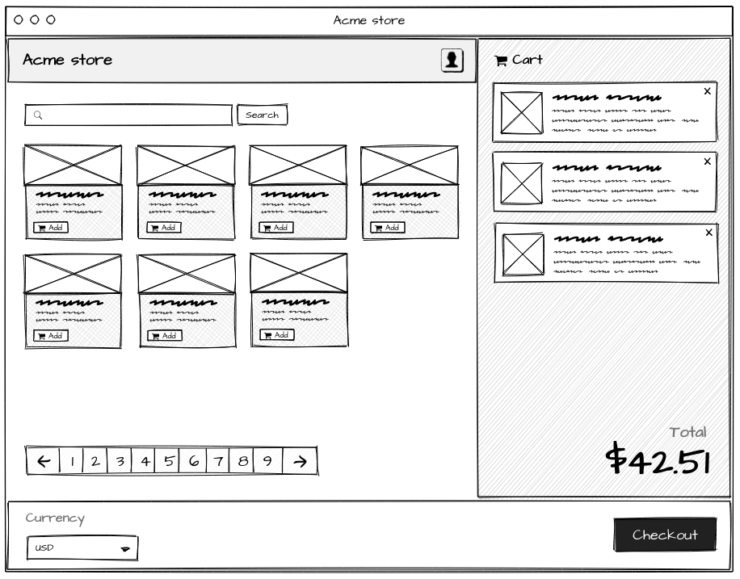

# Autify Front-end Assignment

Thank you for participating in Autify's front-end technical assignment. Please read the introductions carefully, and let us know if you have any questions. If you bump into any issues during the assignment, feel free to reach us out.

## ACTIONS 


## Features
  - Docker
  - Docker-compose (for local development)
  - make file for newcomers 
  - github actions: runs lint (super-lint), and runs the test
  - tailwind
  - husky pre-commit action 
  - testing setup with jest


## Development Docker Image

This readme explains how to build and run a development docker image using the makefile commands.

## Prerequisites

- You need to have docker and docker-compose installed on your system.
- You need to have a dockerfile and a docker-compose.yml file in the same directory as the makefile.

## Makefile Commands

The makefile contains the following commands:

- `make remove-development`: This command stops and removes any existing development docker containers and networks.
- `make build-development`: This command builds the development docker image using the dockerfile and the docker-compose.yml file.
- `make start-development`: This command starts the development docker container and attaches it to the network specified in the docker-compose.yml file.

## Usage

To use the makefile commands, follow these steps:

1. Open a terminal and navigate to the directory where the makefile, the dockerfile and the docker-compose.yml file are located.
2. Run `make remove-development` to stop and remove any existing development docker containers and networks. This is optional but recommended to avoid conflicts.
3. Run `make build-development` to build the development docker image. This may take some time depending on the size and complexity of your image.
4. Run `make start-development` to start the development docker container and attach it to the network. You should see some output from the container indicating that it is running.
5. To stop the development docker container, press Ctrl+C in the terminal or run `make remove-development` in another terminal.


## Instruction

When you finish the assignment

1. Create a private repository in your own GitHub account
2. Push this project to that repository
3. Invite @CYBAI and @ykhs as collaborators

## Tips

1. Decide on your front-end stack. You are free to use the modern front-end technologies of your choice for things like styling, testing, linting etc. You are also free to utilize any tool, library, UI toolkit etc. that you normally use in your projects. It's an empty canvas, and you're the artist! We only ask you to make sure to use **React** and **Typescript**.

2. You will work on the provided [Next.js](https://nextjs.org/docs/getting-started) application. While you don't need to know much about Next.js to complete this assignment, we encourage you to check out the basics. You might find using some Next.js features (such as SSR) in your assignment to be useful and time saving.

3. We care about your code being linted, clean, readable, maintainable, well-tested, and well-documented as much as we care about the end result. We'd like to know your reasoning behind your design and code. Documentation would help us not to misunderstand and overlooking your intentions. You are free to chose the technologies you enforce these things with, but please make sure to do so.

4. Please make sure that your build works, and we can run your code. If the build breaks due to minor issues like linting, **we will** try our best to get around it and somehow run your code to evaluate it. However keep in mind that this might effect your overall score.

# Acme Store

Acme Corporation decided to create an online store after receiving so many complaints from frustrated customers having trouble with ordering and shipping, and they need your help!


## Challenges

- You are asked to create the main screen for their online store with the following features:

  - View products
  - Paginate / search for products
  - Add products to cart
  - Remove products from cart
  - See a list of products in cart
  - See the total price of the items in cart
  - Change the currency
  - Check out

- You are provided with the wireframe below. Acme Corp's designers wanted you to know that it's important to them that you stay true to the wireframe they've created. They asked you to study the wireframe carefully, and follow the exact layout they've created. However, they left the look-and-feel of the product completely to you, so don't hesitate to get creative!



- You're told to support multiple currencies. There should be a global currency selector that defaults to USD, and is populated with the supported currency data provided by the API. Selecting a currency should change all currency values on the screen.

- Items in the grid should feature product image, title, description, price (in selected currency), and an "Add" button that adds the item to the cart.

- Each item in the cart should be displayed in the cart view. They should feature product image, title, description, price, and a button that removes the item from the card. Down below, the total price of the items in the cart should be displayed in selected currency.

- Search input should filter the items, and pagination component should control the pagination.

- You are given an API to pull data from, and told not to worry about POST'ing anything. You are free to utilize the API any way you want. However, you're asked **not to** alter anything in the `pages/api` and `common/` directories. You're also asked **not to import** data from `common/data.ts` in the front-end, and consume data through the API.

Here are the endpoints _(note: click [here](https://apidocjs.com) for api-docs format docs)_:

```typescript
/**
 * GET /api/currencies
 *
 * @api {get} /api/currencies Request supported currencies
 * @apiSuccess {ApiCurrenciesResponse}  response List of supported currencies
 * @apiSuccess {CurrencyKey}            response.key Currency code
 * @apiSuccess {string}                 response.symbol Currency symbol
 * @apiSuccess {number}                 response.usdCoef
 *   This value can be used to convert a convercy to and from USD.
 *   price_in_currency = price_in_usd * currency_usdCoef
 * @apiSuccessExample {json} Success-Response:
 *     HTTP/1.1 200 OK
 *     [
 *       { key: "usd", symbol: "$", usdCoef: 1 },
 *       { key: "eur", symbol: "€", usdCoef: 0.87534666 },
 *       { key: "gbp", symbol: "£", usdCoef: 0.7386999 },
 *       { key: "cad", symbol: "$", usdCoef: 1.2671499 },
 *       { key: "jpy", symbol: "¥", usdCoef: 115.52954 }
 *     ]
 *
 *
 *
 * GET /api/items
 *
 * @api {get} /api/items Request items
 * @apiParam {ApiItemsRequest}      params
 * @apiParam {number}               params[limit]=10
 * @apiParam {number}               params[offset]=0
 * @apiParam {string}               [params[query]]
 * @apiSuccess {ApiItemsResponse}   response
 * @apiSuccess {number}             response[total]
 * @apiSuccess {number}             response[perPage]
 * @apiSuccess {Item[]}             response[items]
 * @apiSuccess {uuid}               response[items[id]]
 * @apiSuccess {string}             response[items[title]]
 * @apiSuccess {string}             response[items[description]]
 * @apiSuccess {string}             response[items[imageSrc]]
 * @apiSuccess {number}             response[items[price]]
 * @apiSuccess {CurrencyKey}        response[items[priceCurrency]]
 * @apiSuccess {date}               response[items[createdAt]]
 * @apiSuccess {date}               response[items[updatedAt]]
 * @apiSuccessExample {json} Success-Response:
 *     HTTP/1.1 200 OK
 *     {
 *       "total": 2,
 *       "perPage": 10,
 *       "items": [
 *          {
 *            "id": "0ba77542-6821-4124-b014-60a892309a8e",
 *            "title": "Explosive tennis balls",
 *            "description": "Tickle your friends! Surprise your opponent!",
 *            "imageSrc": "https://..."
 *            "price": 4.99,
 *            "priceCurrency": "usd",
 *            "createdAt": "2022-01-10T10:39:39.607Z",
 *            "updatedAt": "2020-02-28T09:06:27.298Z",
 *          },
 *          {
 *            "id": "98024716-6ca5-49ac-bbd6-a733a47f97a9",
 *            "title": "Dehydrated Boulders",
 *            "description": "Just add water",
 *            "imageSrc": "https://..."
 *            "price": 7.49,
 *            "priceCurrency": "eur",
 *            "createdAt": "2022-01-10T10:39:39.607Z",
 *            "updatedAt": "2020-02-28T09:06:27.298Z",
 *          }
 *       ]
 *     }
 */
```


